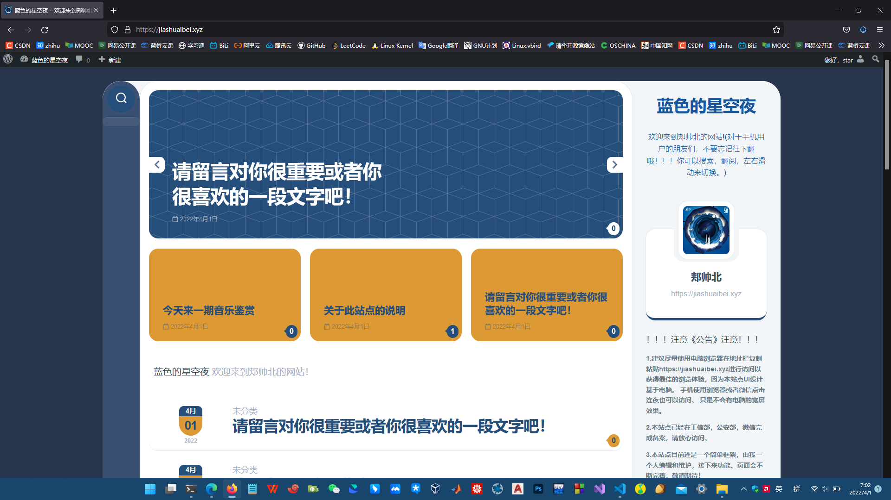

## 服务器

使用阿里云ECS云服务器，续费到2023年只需要80元，可以接受。

内存带宽应该够用

## 架构

建议首选WordPress，也应考虑typoche的handsome

wordpress主题 Textdash

## 内容

这里主要不是笔记，而是记录。

记录我学习的一个个区块知识，记录学习过程，学习方法，自己的想法，总结，以及知识源

同时记录自己的歌种想法，就是我的空间，和自己对话。

## 备份

通过本地的typora写作，放在一个文件夹里，并且通过git同步到GitHub作为备份。

